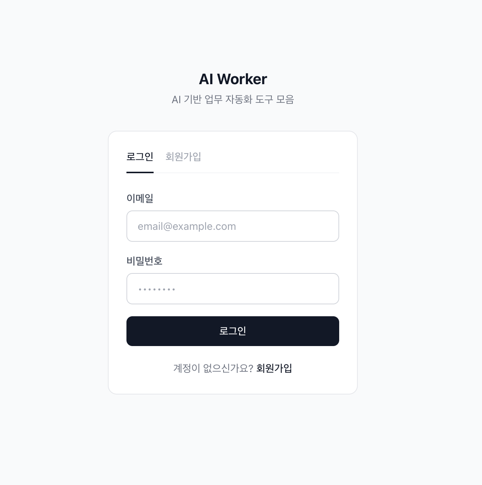
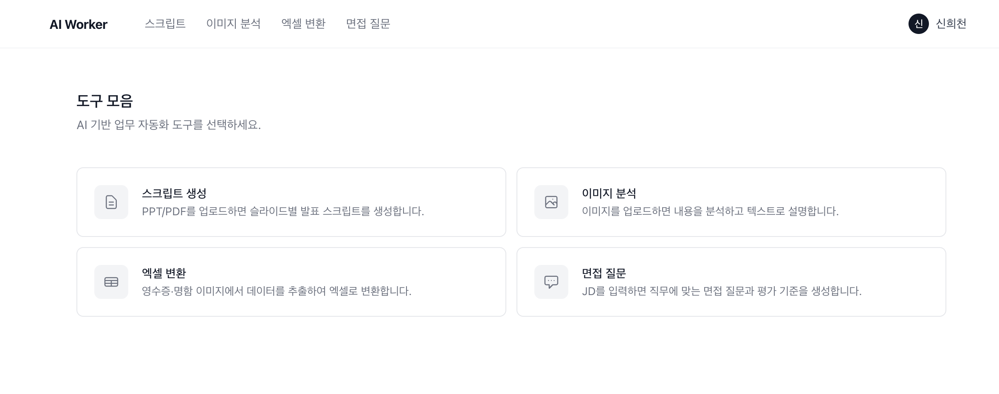
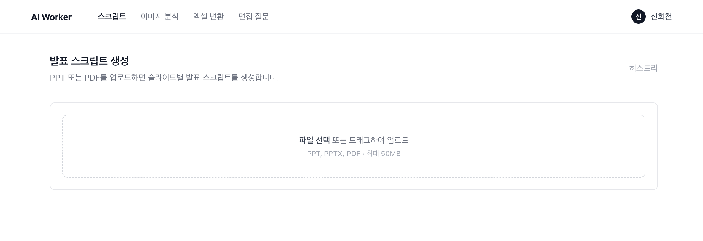
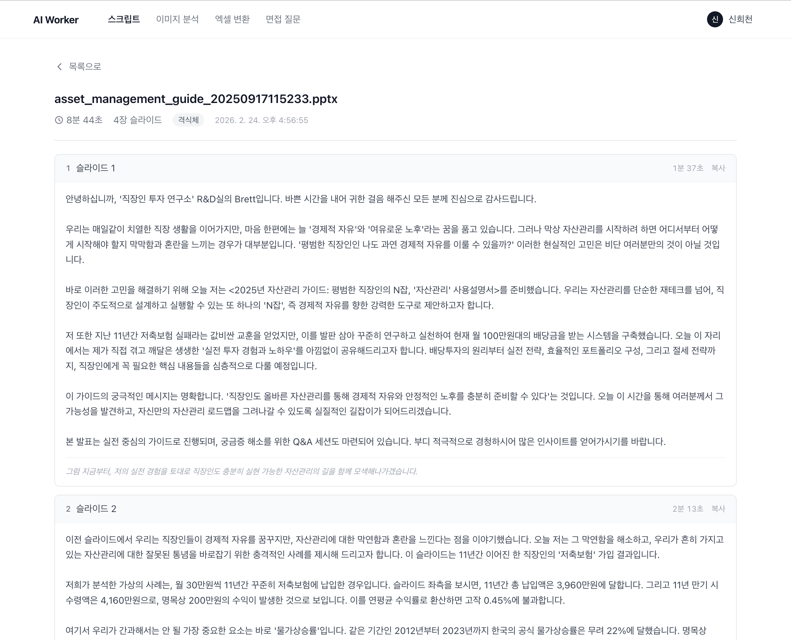
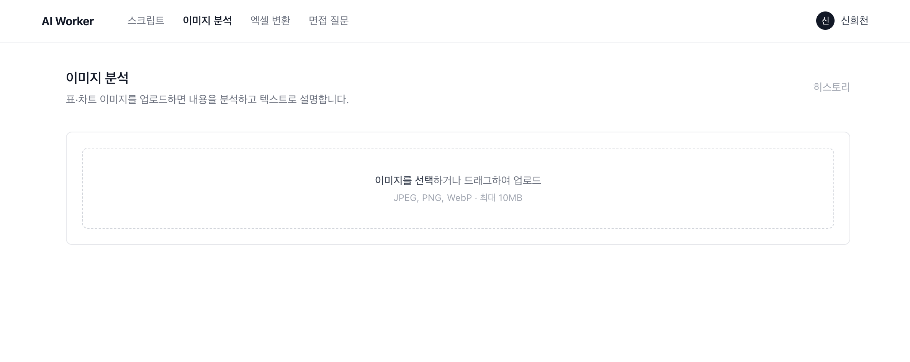
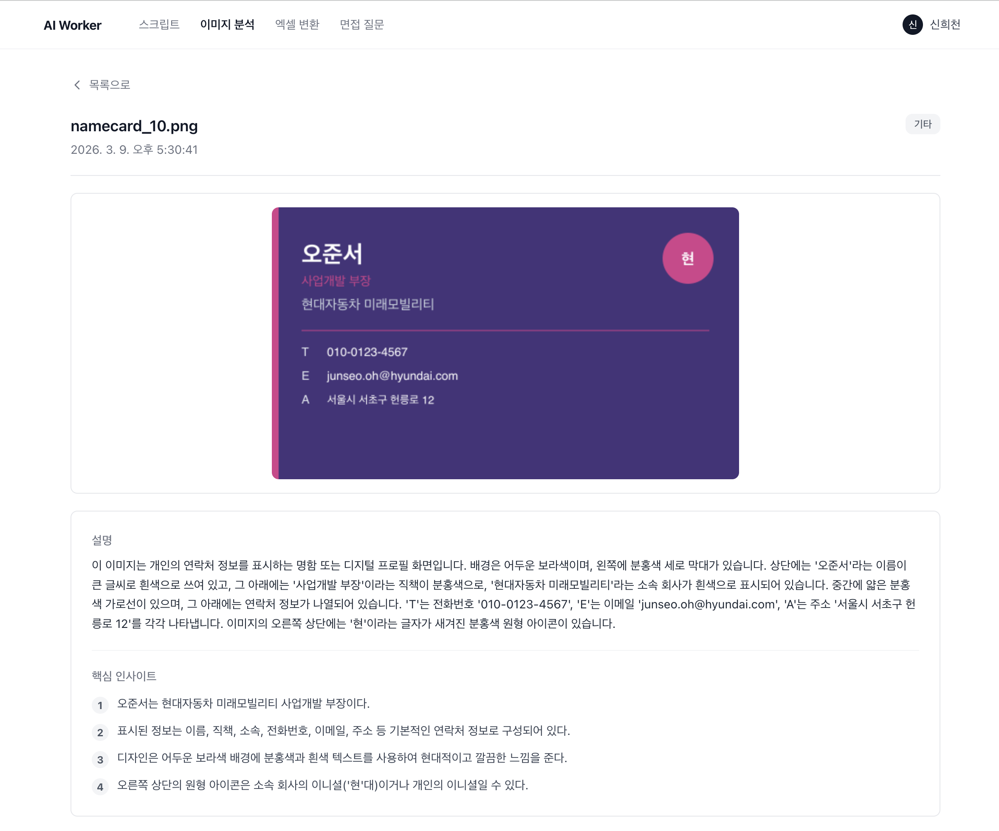
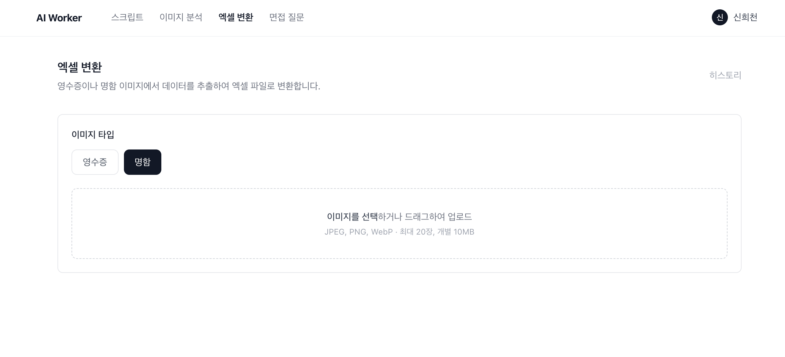
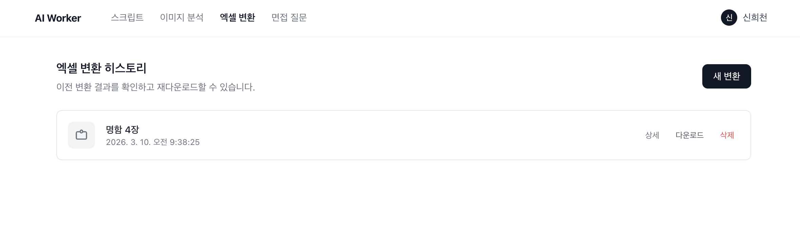
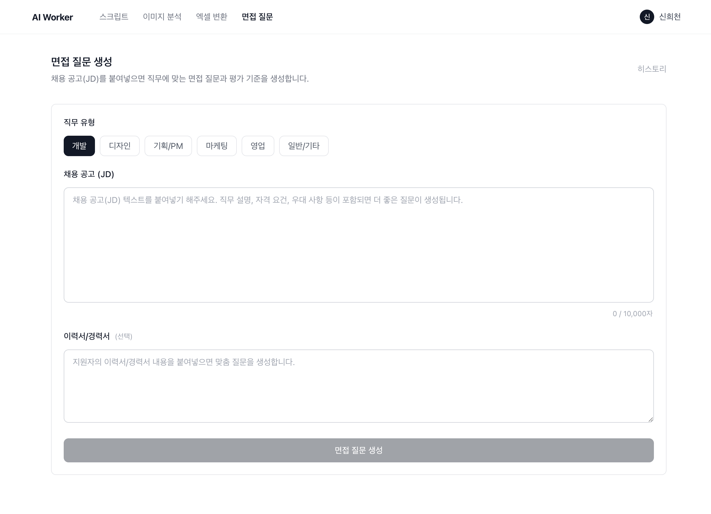
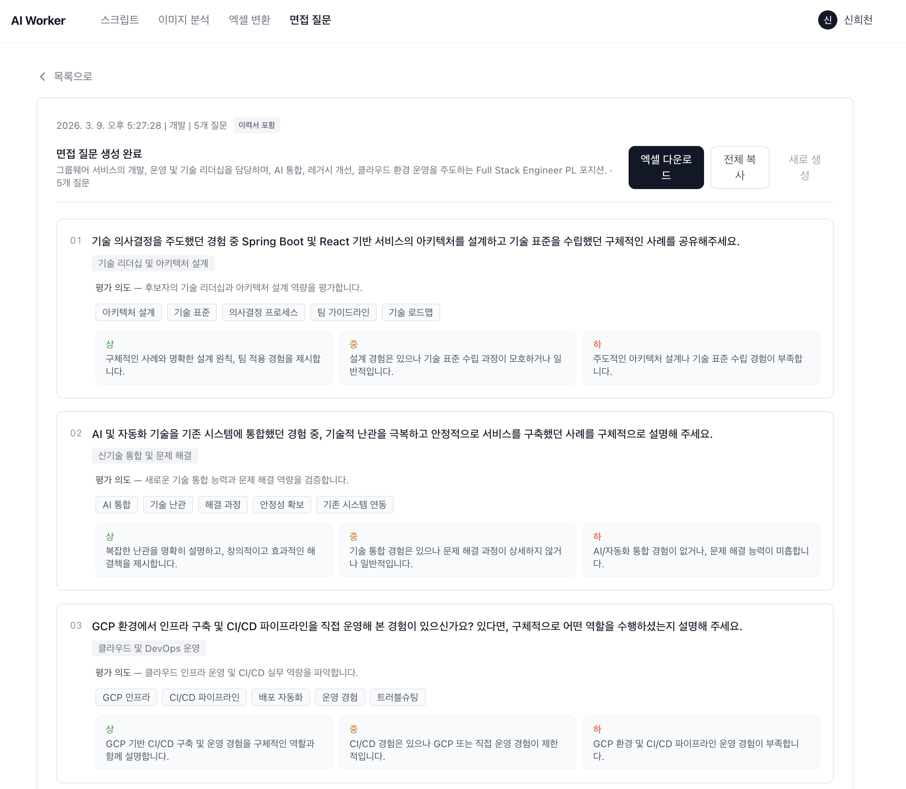

# 프로젝트 개요

- **프로젝트명**: AI Worker — AI 기반 업무 자동화 도구 모음 플랫폼
- **개발 기간**: 2025.02 ~ 2026.03
- **개발 인원**: 1명
- **목적**: 사내 반복 업무를 AI로 자동화하여 업무 효율 향상

---

# 주요 기능 (4가지)

| 기능               | 설명                                                |
| ------------------ | --------------------------------------------------- |
| 발표 스크립트 생성 | PPT/PDF 업로드 → 슬라이드별 발표 스크립트 자동 생성 |
| 이미지 분석        | 표/차트 이미지 → 텍스트 설명 + 핵심 인사이트        |
| 엑셀 변환          | 영수증/명함 이미지 → 구조화 데이터 → 엑셀 다운로드  |
| 면접 질문 생성     | 채용 공고(JD) + 이력서 → 맞춤 면접 질문 + 평가 기준 |

---

# 사용한 AI 도구

## 서비스 탑재 AI

- **Google Gemini 2.5** (Vision API)
  - 슬라이드 이미지 분석 및 발표 스크립트 생성
  - 이미지 콘텐츠 분석 (표, 차트)
  - 영수증/명함 데이터 추출
  - 면접 질문 및 평가 기준 생성

---

# 사용한 AI 도구 (계속)

## 개발에 활용한 AI Tool

- **Claude Code** (Anthropic)
  - TDD 기반 코드 작성 및 테스트 자동 생성
  - 코드 리뷰, 디버깅, Git 워크플로우 자동화
  - 커스텀 스킬로 반복 워크플로우 자동화

---

# 시스템 아키텍처

```
  React Client ──→ NestJS API ──→ PostgreSQL
  (Vite, :5175)    (:3002)
                      │
                 Gemini API
                 (Vision)
```

- **모노레포 구조**: pnpm workspace (apps/api-server + apps/user-client)
- **컨테이너화**: Docker Compose (API + Client + DB)

---

# 기술 스택

| 영역         | 기술                                                |
| ------------ | --------------------------------------------------- |
| 프론트엔드   | React 19, Vite 7, TypeScript, Tailwind CSS, Zustand |
| 백엔드       | NestJS 11, Express 5, Prisma 7, Passport JWT        |
| 데이터베이스 | PostgreSQL                                          |
| AI           | Google Gemini 2.5 Flash (Vision API)                |
| 인프라       | Docker, Docker Compose, Nginx                       |
| 테스트       | Jest (백엔드), Vitest (프론트엔드)                  |

---

# 화면 — 로그인 / 메인




---

# 기능 상세 — 발표 스크립트 생성

## 3단계 AI 파이프라인

1. **슬라이드 분석**: Gemini Vision으로 슬라이드 이미지 분석
2. **맥락 기반 생성**: 이전 슬라이드 맥락을 반영한 스크립트 생성
3. **후처리 리파인**: 톤, 시간, 일관성 고려하여 정제

- PPT→PDF→이미지 자동 변환 (LibreOffice, Poppler)
- 격식체/비격식체, 목표 발표 시간 설정 가능
- 전체 복사, TXT 다운로드, 히스토리 관리




---

# 기능 상세 — 이미지 분석

- 표, 차트, 기타 이미지 업로드
- Gemini Vision API로 콘텐츠 분석
- **출력**: 텍스트 설명 + 핵심 인사이트 목록
- 이미지 타입 자동 분류
- 분석 히스토리 관리 (재조회/삭제)




---

# 기능 상세 — 엑셀 변환

- 영수증 또는 명함 이미지 **다중 업로드**
- Gemini Vision API로 구조화 데이터 추출
- **영수증**: 날짜, 상호명, 항목요약, 합계금액, 결제수단
- **명함**: 이름, 직함, 회사명, 전화번호, 이메일, 주소
- 엑셀 파일 다운로드 (ExcelJS)
- 변환 히스토리 관리




---

# 기능 상세 — 면접 질문 생성

- 채용 공고(JD) 텍스트 입력 + 이력서/경력서 (선택)
- 6개 직무 유형: 개발, 디자인, 기획, 마케팅, 영업, 일반
- **출력 (질문 5개)**:
  - 면접 질문 + 평가 의도
  - 우수 답변 키워드
  - 상/중/하 평가 기준
- 엑셀 다운로드, 전체 복사 기능




---

# 데이터베이스 설계

```
User (1) ──→ (N) PresentationHistory
     (1) ──→ (N) ImageAnalysisHistory
     (1) ──→ (N) ImageToExcelHistory
     (1) ──→ (N) InterviewHistory
```

- 5개 테이블, userId + createdAt 복합 인덱스
- JSON 필드로 유연한 결과 데이터 저장
- User 삭제 시 히스토리 Cascade 삭제

---

# 프로젝트 규모

| 지표                 | 수치                             |
| -------------------- | -------------------------------- |
| 총 커밋 수           | 33                               |
| TypeScript 파일 수   | 204                              |
| 총 코드 라인 수      | 약 29,000줄                      |
| 백엔드 모듈          | 6개                              |
| 프론트엔드 기능 모듈 | 6개                              |
| DB 테이블            | 5개                              |
| 테스트 파일          | 39개 (백엔드 21 + 프론트엔드 18) |

---

# 개발 방법론

## TDD (테스트 주도 개발)

- Red → Green → Refactor 사이클
- `[BEHAVIORAL]` / `[STRUCTURAL]` 커밋 구분

## AI 페어 프로그래밍

- Claude Code로 PRD → 계획 → TDD → 코드 리뷰 전 과정 AI 활용
- 커스텀 스킬 `/prd`, `/plan`, `/go-phase` 등으로 워크플로우 자동화

---

# 보안 및 배포

## 보안

- 이메일/비밀번호 인증 (bcrypt 해싱)
- JWT 토큰 기반 API 접근 제어
- CORS Origin 제한, 입력 검증, 데이터 격리

## 배포

- Docker Compose 기반 컨테이너 배포
- API: NestJS + LibreOffice + Poppler
- Client: React 빌드 + Nginx 서빙
- DB: PostgreSQL

---

# 기대효과

## 업무 효율화

- 발표 스크립트 수작업 작성 → AI 자동 생성 (슬라이드당 수분 → 수초)
- 영수증/명함 수기 입력 → 이미지 촬영만으로 엑셀 자동 변환
- 면접 질문 설계 시간 단축 (JD 분석 + 평가 기준까지 일괄 생성)

## 품질 향상

- 슬라이드 맥락을 반영한 일관된 발표 스크립트
- 구조화된 면접 평가 기준 (상/중/하)으로 면접 공정성 확보
- 사람에 따른 품질 편차 감소

## 비용 절감

- Gemini Flash 모델 사용으로 저비용 AI 처리
- 외부 SaaS 구독 없이 자체 플랫폼으로 운영
- 1인 개발 (AI 페어 프로그래밍으로 생산성 극대화)

## AI 역량 내재화

- Gemini Vision API 활용 노하우 축적
- AI 기반 서비스 설계/개발 경험 확보
- TDD + AI 페어 프로그래밍 개발 방법론 검증

---

# 향후 계획

- 다국어 스크립트 생성 지원
- 팀 공유 기능 (히스토리 공유, 협업)
- 추가 AI 모델 지원 (GPT-4o, Claude 등 선택 가능)
- 발표 리허설 모드 (타이머 + 스크립트 프롬프터)
- 관리자 대시보드 (사용 통계, 사용자 관리)

---

# 감사합니다
